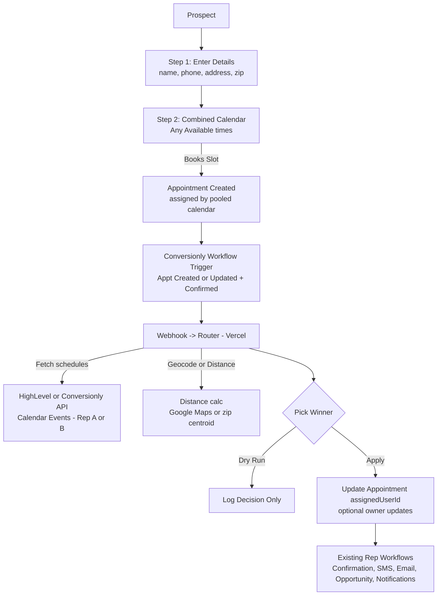

# route-optimizer
Small router built to call an API service, serve as a stop-gap for appointment assignment on SJ Blinds reps

```mermaid
flowchart TD
  U[Prospect] --> S1[Step 1: Enter Details<br/>name, phone, address, zip]
  S1 --> S2[Step 2: Combined Calendar<br/>Any Available times]
  S2 -->|Books Slot| A[Appointment Created<br/>assigned by pooled calendar]
  A --> W[Conversionly Workflow Trigger<br/>Appt Created or Updated + Confirmed]
  W --> H[Webhook -> Router - Vercel]
  H -->|Fetch schedules| API1[HighLevel or Conversionly API<br/>Calendar Events - Rep A or B]
  H -->|Geocode or Distance| MAPS[Distance calc<br/>Google Maps or zip centroid]
  H --> D{Pick Winner}
  D -->|Dry Run| L[Log Decision Only]
  D -->|Apply| UPD[Update Appointment assignedUserId<br/>optional owner updates]
  UPD --> F1[Existing Rep Workflows<br/>Confirmation, SMS, Email, Opportunity, Notifications]

```
